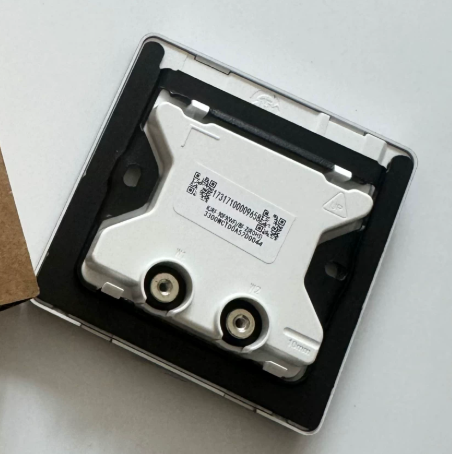
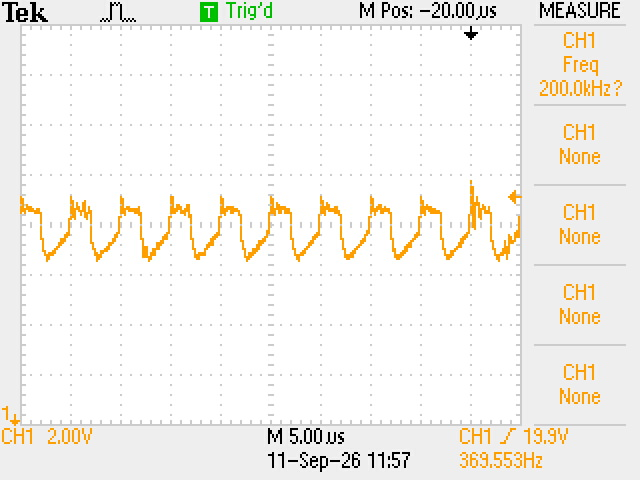
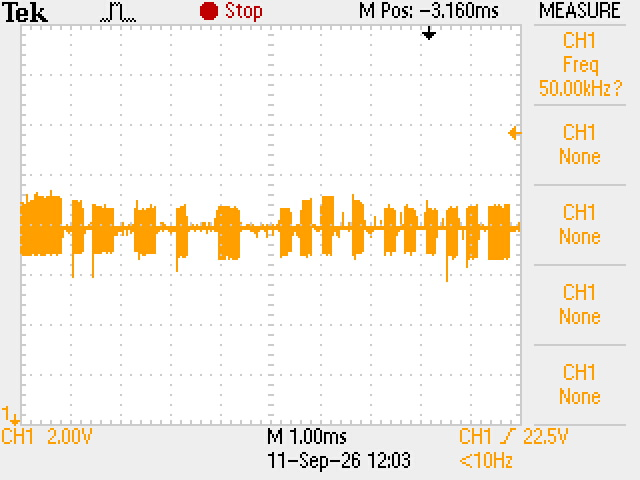
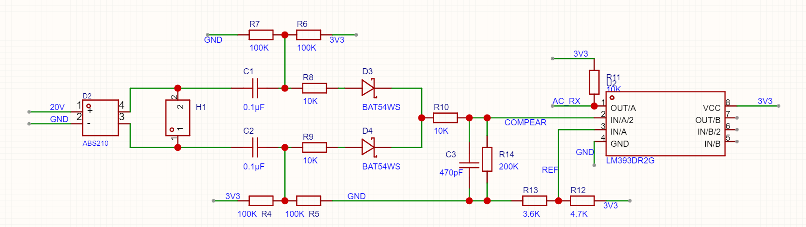
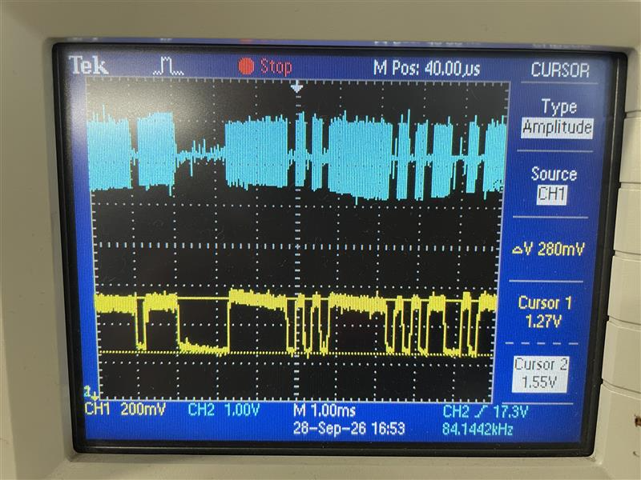
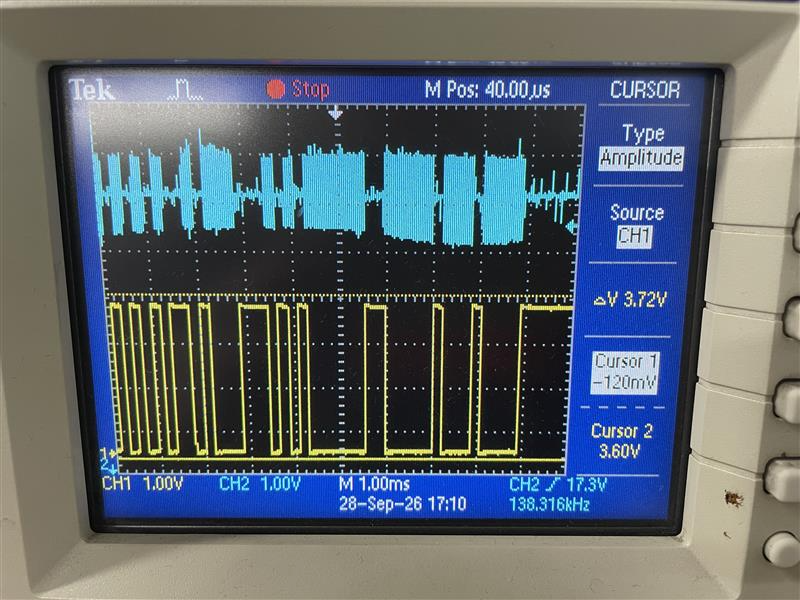
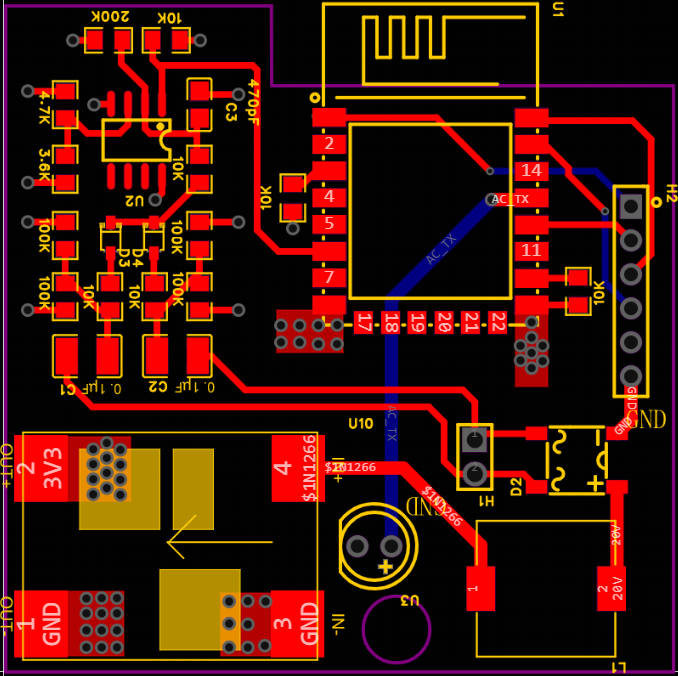

# Midea X1/X2 Two-Wire Bus Protocol

Reverse engineering of the polarity-free two-wire bus between the wired controller and the indoor unit of Midea central air conditioners.

[中文版 (Chinese version)](README.zh-CN.md)

## 1. Project Background

The wall-mounted control panel of a Midea central air conditioner connects to the indoor unit main board through a single two-core wire. This wire carries both power supply and bidirectional communication, and is polarity-free (either wire can be swapped) — a typical private "power + communication" multiplexed bus.

Project goal: tap into this bus with an ESP8266, decode Midea's proprietary protocol (XYE protocol family), and report the AC status.

## 2. Physical Layer Findings

Through oscilloscope capture and analysis, the physical layer parameters of the bus were finally confirmed:

| Parameter | Value |
| :--- | :--- |
| Bus DC voltage | approx. 18–20 V |
| Carrier frequency | 200 kHz |
| Carrier amplitude | approx. 1 V peak-to-peak |
| Modulation | OOK / ASK (carrier present/absent represents 0/1) |
| Bit width | approx. 208 µs (4800 bps UART, 1 bit ≈ 208 µs) |
| Bus polarity | None; the two wires are interchangeable |

Final conclusion: the physical layer is essentially a 4800 bps UART signal transmitted via OOK modulation on a 200 kHz carrier.

## 3. Hardware Design

### 3.1 Signal Chain

Polarity-free bus

    │
    ├──→ Bridge rectifier → Inductor → DC-DC → 3.3 V power supply
    │
    └──→ Coupling capacitor → Bias → Envelope detector → Comparator → ESP8266 GPIO

### 3.2 Final Circuit Parameters

DC blocking and biasing:

| Component | Value | Purpose |
| :--- | :--- | :--- |
| C1, C2 | 0.1 µF / 100 V SMD C0G | Block the 20 V DC, pass only the 200 kHz carrier |
| R6/R7, R4/R5 | 100 kΩ + 100 kΩ | Independent bias to 1.65 V, one pair each for A' and B' |

Envelope detection:

| Component | Value | Purpose |
| :--- | :--- | :--- |
| D3, D4 | BAT54S Schottky | Dual-channel detection, handles polarity-free input |
| R10 | 10 kΩ | Charging current limit |
| C3 | 470 pF | Filter out the 200 kHz carrier |
| R_14 | 200 kΩ | Capacitor discharge path |

 

The detected signal swings between 1.55 V and 1.27 V. So 1.41 V was chosen as the comparator reference voltage.

Comparator:

| Component | Value | Purpose |
| :--- | :--- | :--- |
| U1 | LM393 | Open-collector output, low cost |
| R11 | 10 kΩ | Pull-up to 3.3 V |
| R_12/R_13 | 4.7 kΩ / 3.6 kΩ | Voltage divider producing approx. 1.41 V reference |

 

The comparator outputs a clean 3.3 V-level signal.

Power supply path:

| Component | Value | Purpose |
| :--- | :--- | :--- |
| Bridge rectifier | ABS210 | Polarity-free rectification |
| Inductor | 470 µH | Isolates the 200 kHz communication signal |
| DC-DC | 20 V → 3.3 V | Powers the ESP8266 |

## 4. Protocol Layer Findings: XYE Protocol Family

The demodulated baseband signal is simply a 4800 bps UART stream. The upper-layer protocol is Midea's proprietary XYE protocol family.

### 4.1 Frame Format

[0]         : 0xAA (frame header)

[1]         : Protocol family (e.g. 0x23 / 0x20 / 0x70 / 0x71 / 0x76)

[2..5]      : Source address and destination address (4 bytes)

[6]         : Payload length (DataLen)

[7..N-5]    : Business data segment (DataLen bytes)

[N-4..N-3]  : 2-byte CRC16 checksum (low byte first, high byte second)

[N-2..N-1]  : 0x55 0xFE (frame tail)

### 4.2 CRC Checksum

CRC-16/MODBUS is used:

- Polynomial: 0xA001 (reflected)
- Initial value: 0xFFFF
- Calculation range: from the 2nd byte (skipping the 0xAA frame header) to just before the checksum field (len − 5 bytes in total)

### 4.3 Indoor Unit Status Frame Decoding

Match conditions:

- Frame header fixed at 0xAA
- Frame tail fixed at 0x55 0xFE
- Command family 0x23 (indoor unit communication)
- Source address 0xF8 (indoor unit main board)
- Function code 0x65 (indoor unit operating parameters / status report response)
- Payload length pBuf[6] >= 10

Payload field decoding:

| Byte | Meaning | Decoding |
| :--- | :--- | :--- |
| pData[0] | Mode / power flag | bit6 or bit7 = power on; low 4 bits = mode (0 auto, 1 fan, 2 cool, 3 heat, 6 dry) |
| pData[1] | Fan speed | 0x80 = auto; 0x01–0x07 = levels 1–7 |
| pData[2] | Set temperature | ((b2 & 0xFE) >> 1) − 40 |
| pData[3] | Fan speed (auxiliary) | — |
| pData[4] | Swing / auxiliary status | — |
| pData[9] | Indoor temperature | b9 − 30 |

Mode flag examples:

- 0x00: power off (Bit 6 = 0)
- 0x42: power on + cooling
- 0x46: power on + dry (dehumidification)
- 0x41: power on + fan only
- 0x43: power on + heating
- 0xC0: power on + auto mode, actually running in cooling

### 4.4 Software Architecture

Serial reception:

- SoftwareSerial receives the 4800 bps UART data
- A 10 ms inter-frame idle timeout marks a frame as complete
- 256-byte receive buffer

Decoding flow:

1. Validate the whole frame (header, tail, length, CRC16)
2. Match the indoor unit status response command
3. Extract the payload and compare with the previous data to detect changes
4. Decode power state, mode, set temperature, fan speed, and indoor temperature

## 5. Key Problems and Solutions

### 5.1 Bridge Rectifier Power Supply Interferes with Communication

Symptom: after connecting the bridge rectifier + DC-DC, the panel and the main board could no longer communicate.

Cause: the DC-DC input capacitor presents a low impedance to the 200 kHz signal, short-circuiting the communication signal.

Solution: insert a 470 µH inductor between the bridge rectifier positive output and the DC-DC input to isolate the 200 kHz signal.

## 6. Final Results

- Physical layer parameters fully confirmed (200 kHz OOK, 20 V bus, polarity-free)
- Confirmed the physical layer is essentially a 4800 bps UART
- Demodulation circuit works properly; the comparator outputs clean 0/3.3 V baseband pulses
- Power supply and communication do not interfere with each other
- Successfully reverse-engineered the XYE protocol family frame format and CRC16 checksum
- Implemented indoor unit status frame decoding (power, mode, set temperature, fan speed, indoor temperature)

## 7. Significance

This project covers the complete workflow of "physical layer reverse engineering → demodulation circuit design → protocol reverse engineering → software implementation → Home Assistant integration", providing a fully reproducible solution for smart-home retrofit of Midea's two-wire polarity-free bus.

The core challenges were small-signal handling on a polarity-free bus, the discharge path design of the envelope detector, and the isolation between power and communication. Once the physical layer was confirmed to be a 4800 bps UART, the protocol reverse engineering became systematic, and both the XYE protocol family frame format and the CRC16 checksum were successfully decoded.
